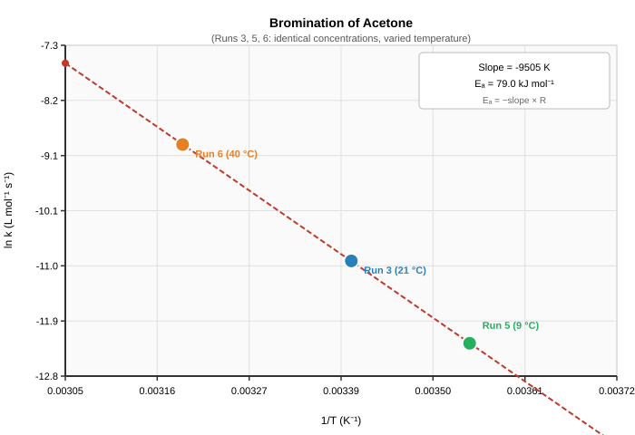

# Lab 8: Chemical Kinetics: The Bromination of Acetone
## Chemistry 150 - Winter 2026

| | |
|---|---|
| **Students** | David Dreyer (C0561419), Dylan Fraser (C0558267) |
| **Lab Section** | 2026W CHEM-150-X01AB |
| **Date Performed** | March 16, 2026 |

## Introduction

Chemical kinetics is the study of how fast chemical reactions proceed. The rate of a reaction describes how quickly reactants are consumed or products are formed over time. For the reaction A → B, the average rate is:

$$\text{Rate} = -\frac{\Delta[\text{A}]}{\Delta t}$$

In this experiment, we study the reaction between acetone and bromine in acidic solution:

$$\text{CH}_3\text{COCH}_3 + \text{Br}_2 \xrightarrow{\text{H}^+} \text{CH}_3\text{COCH}_2\text{Br} + \text{HBr}$$

Because bromine is the only coloured compound in the reaction, its disappearance can be tracked visually. When [Br₂] is kept very low relative to the other reactants, the rate simplifies to:

$$\text{Rate} = \frac{[\text{Br}_2]_i}{\Delta t}$$

The rate law has the form:

$$\text{Rate} = k[\text{acetone}]^a[\text{Br}_2]^b[\text{H}^+]^c$$

where *a*, *b*, and *c* are the reaction orders (unknown at the start) and *k* is the rate constant. Reaction orders are found by changing one concentration at a time: if doubling a concentration doubles the rate, the order for that reactant is 1; if the rate does not change, the order is 0.

The rate constant *k* depends on temperature. This dependence is described by the following equation:

$$k = A\,e^{-E_a/RT}$$

Taking the natural log of both sides gives the linear form:

$$\ln k = \ln A - \frac{E_a}{R}\cdot\frac{1}{T}$$

A plot of ln *k* vs 1/*T* gives a straight line with slope $-E_a/R$, from which the activation energy *E*ₐ can be calculated.

---

## Objective

1. Determine the reaction orders *a*, *b*, and *c* for acetone, Br₂, and HCl.
2. Calculate the rate constant *k* at room temperature.
3. Determine the activation energy *E*ₐ from the slope of the ln *k* vs 1/*T* plot (Runs 3, 5, and 6).

---

## Method

The procedure followed Lab 8 of the Chemistry 150 Lab Manual W 2026. Six trials were run using three stock solutions: acetone (4.00 mol/L), HCl (1.00 mol/L), and Br₂ (0.0200 mol/L). Each trial mixed these stocks with deionised water to a total volume of 25 mL, in proportions given in Table 1. Bromine was added last and the timer started immediately. The flask was held over white paper to help see the colour change. Time was stopped when the orange colour disappeared completely.

Trials 1–4 were run at room temperature (~21 °C). Trial 5 was run in an ice-water bath (~9 °C) and Trial 6 in a warm-water bath (~40 °C).

Working concentrations were calculated by dilution:

$$[\text{species}]_{\text{rxn}} = [\text{stock}] \times \frac{V_{\text{species}}}{V_{\text{total}}}$$

---

## Data

**Table 1.** Volumes, decolorisation times, working concentrations, and rates.

| Run | T (°C) | V acetone (mL) | V HCl (mL) | V Br₂ (mL) | V H₂O (mL) | ΔTime (s) | [acetone] (mol/L) | [HCl] (mol/L) | [Br₂] (mol/L) | Rate (mol/L·s) |
|:---:|:---:|:---:|:---:|:---:|:---:|:---:|:---:|:---:|:---:|:---:|
| 1 | 21 | 5 | 5 | 5 | 10 | 1335.2 | 0.800 | 0.200 | 0.00400 | 2.996 × 10⁻⁶ |
| 2 | 21 | 10 | 5 | 5 | 5  | 664.2  | 1.600 | 0.200 | 0.00400 | 6.022 × 10⁻⁶ |
| 3 | 21 | 5 | 10 | 5 | 5  | 678.5  | 0.800 | 0.400 | 0.00400 | 5.895 × 10⁻⁶ |
| 4 | 21 | 5 | 5 | 10 | 5  | 2653.9 | 0.800 | 0.200 | 0.00800 | 3.014 × 10⁻⁶ |
| 5 | 9  | 5 | 10 | 5 | 5  | 2703.3 | 0.800 | 0.400 | 0.00400 | 1.480 × 10⁻⁶ |
| 6 | 40 | 5 | 10 | 5 | 5  | 96.2   | 0.800 | 0.400 | 0.00400 | 4.158 × 10⁻⁵ |

---

## Results

### Reaction Orders

Each order is found by comparing two runs where only that reactant's concentration changed.

**Order in acetone (*a*): Runs 1 and 2**

[acetone] doubled from 0.800 to 1.600 mol/L; all other concentrations identical.

$$\frac{\text{Rate}_2}{\text{Rate}_1} = \frac{6.022 \times 10^{-6}}{2.996 \times 10^{-6}} = 2.01 \approx 2^1 \implies a = 1$$

**Order in Br₂ (*b*): Runs 1 and 4**

[Br₂] doubled from 0.00400 to 0.00800 mol/L; all other concentrations identical.

$$\frac{\text{Rate}_4}{\text{Rate}_1} = \frac{3.014 \times 10^{-6}}{2.996 \times 10^{-6}} = 1.01 \approx 2^0 \implies b = 0$$

**Order in HCl (*c*): Runs 1 and 3**

[HCl] doubled from 0.200 to 0.400 mol/L; all other concentrations identical.

$$\frac{\text{Rate}_3}{\text{Rate}_1} = \frac{5.895 \times 10^{-6}}{2.996 \times 10^{-6}} = 1.97 \approx 2^1 \implies c = 1$$

**Rate law:**

$$\boxed{\text{Rate} = k[\text{acetone}][\text{HCl}]}$$

---

### Rate Constant *k* at 21 °C

With *a* = 1, *b* = 0, *c* = 1, the rate constant for each room-temperature run is:

$$k = \frac{\text{Rate}}{[\text{acetone}][\text{HCl}]}$$

**Table 2.** Rate constant *k* and temperature parameters for each run.

| Run | Rate*ₙ*/Rate₁ | *k* (L mol⁻¹ s⁻¹) | ln *k* | 1/*T* (K⁻¹) |
|:---:|:---:|:---:|:---:|:---:|
| 1 | 1  | 1.872 × 10⁻⁵ | −10.886 | 0.003400 |
| 2 | 2  | 1.882 × 10⁻⁵ | −10.881 | 0.003400 |
| 3 | 2  | 1.842 × 10⁻⁵ | −10.902 | 0.003400 |
| 4 | 1  | 1.884 × 10⁻⁵ | −10.880 | 0.003400 |
| 5 | n/a | 4.625 × 10⁻⁶ | −12.284 | 0.003544 |
| 6 | 14 | 1.299 × 10⁻⁴ | −8.948  | 0.003193 |

Average *k* at 21 °C (Runs 1–4):

$$\bar{k}_{21} = \frac{1.872 + 1.882 + 1.842 + 1.884}{4} \times 10^{-5} = 1.870 \times 10^{-5}\ \text{L mol}^{-1}\text{ s}^{-1}$$

---

### Activation Energy

Runs 3, 5, and 6 have identical concentrations and only the temperature differs, so they are used for the ln *k* vs 1/*T* plot.

**Figure 1.** ln *k* vs 1/*T* for Runs 3 (21 °C), 5 (9 °C), and 6 (40 °C).

From the slope of the best-fit line:

$$\text{slope} = -\frac{E_a}{R} = -9505\ \text{K}$$

$$E_a = 9505\ \text{K} \times 8.314\ \text{J mol}^{-1}\text{K}^{-1} = 79{,}020\ \text{J mol}^{-1} \approx \boxed{79.0\ \text{kJ mol}^{-1}}$$

---

## Discussion

**Reaction orders.** Doubling [acetone] doubled the rate (ratio 2.01, Runs 1 and 2). Doubling [HCl] also doubled the rate (ratio 1.97, Runs 1 and 3). Both results are close enough to 2 to conclude first-order dependence on each. Doubling [Br₂] had almost no effect on the rate (ratio 1.01, Runs 1 and 4), giving zero-order dependence on Br₂. The rate law is therefore Rate = *k*[acetone][HCl].

**Consistency of *k*.** The four room-temperature trials give *k* values ranging only from 1.842 to 1.884 × 10⁻⁵ L mol⁻¹ s⁻¹. This is a good result: if the order assignments were wrong, *k* would shift across the trials as the concentrations change.

**Temperature effect.** At 9 °C (Run 5) the reaction took 2703 s to decolorise; at 40 °C (Run 6) it took only 96 s. Since concentrations were the same in both, this large difference comes entirely from temperature increasing the rate constant. This is consistent with the equation above, which predicts *k* grows exponentially with temperature.

**Sources of error.** The main source of error is the endpoint judgment. The Br₂ colour fades gradually rather than disappearing sharply, so there is subjectivity in stopping the timer. This error is proportionally larger for fast trials like Run 6 (96 s) than for slow ones. Temperature control in the ice and warm baths was also imperfect; any variation from the nominal temperatures would shift the *k* values and affect the slope of the ln *k* vs 1/*T* plot.

---

## Conclusion

The rate law for the bromination of acetone is Rate = *k*[acetone][HCl], with orders a = 1, b = 0, c = 1. The zero-order dependence on Br₂ means changing [Br₂] does not affect how fast the reaction proceeds. The rate constant at 21 °C is **1.870 × 10⁻⁵ L mol⁻¹ s⁻¹**. The activation energy from the ln *k* vs 1/*T* plot is **79.0 kJ mol⁻¹**.

---

## Reference

Chemistry 150 Lab Manual W 2026, Lab 8: Chemical Kinetics: The Bromination of Acetone.
