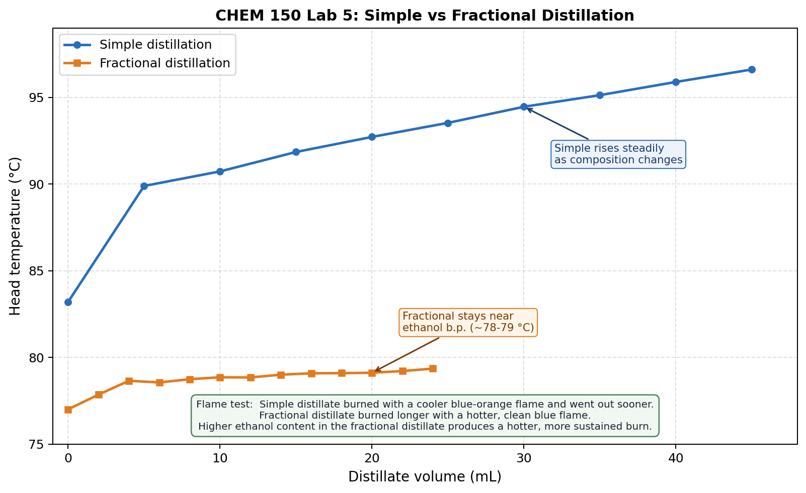

# Lab 5: Distillation
## Chemistry 150 - Winter 2026

| | |
|---|---|
| **Students** | David Dreyer (C0561419), Dylan Fraser (C0558267) |
| **Lab Section** | 2026W CHEM-150-X01AB |
| **Date Performed** | February 23, 2026 |

## Introduction

Distillation separates a liquid mixture by heating it until the more volatile component evaporates, then condensing and collecting the vapour. Simple distillation passes vapour directly into the condenser in one step. Fractional distillation adds a Vigreux column between the flask and condenser, giving the vapour multiple chances to equilibrate on the way up. This is similar to running several simple distillations in a row and gives a purer product.

Ethanol boils at 78.5 °C and water at 100 °C. They form an azeotrope at 95.6% (v/v) ethanol with a boiling point of 78.2 °C, which is the highest purity achievable by distillation at atmospheric pressure. As ethanol is depleted from the flask the head temperature rises, and how fast it rises gives an idea of how well the separation is working.

In this experiment, simple and fractional distillation of a wine-based mixture are compared using temperature profiles, a flame test, and a density measurement of the final product.

---

## Objective

To compare simple and fractional distillation and comment on relative efficiency, supported by:

1. Temperature vs. volume profiles for both runs on one graph.
2. Flame test observations of the two distillates.
3. Density of the fractional distillate converted to % (v/v) ethanol.

---

## Method

The procedure followed Lab 5 of the Chemistry 150 Lab Manual W 2026 (pp. 27-29). A 500 mL round-bottom flask was charged with 250 mL of red wine and one or two boiling chips. The apparatus was set up with a still head, water-jacketed condenser, and collection vessel. The LabPro temperature probe was positioned at the still head and data was collected in LoggerPro using Events with Entry mode. Heat was applied gently with a micro Bunsen burner to keep the boil slow and steady. Temperature was recorded at 0 mL (first drop) and then every 5 mL of condensate. Collection stopped at 98 °C or 40 mL, whichever came first. About 5 mL of the simple distillate was set aside in a ceramic evaporating dish for the flame test.

**Note:** The collection beaker broke during the simple distillation run and most of the distillate was lost. The instructor was informed and provided a replacement ethanol-water sample for the fractional distillation. The portion already set aside for the flame test was not affected.

For the fractional distillation, the apparatus was reassembled with a Vigreux column. The replacement sample was charged into the flask with fresh boiling chips. Temperature was recorded every 2 mL and collection stopped when the temperature began to rise sharply.

For the flame test, about 1-2 mL of each distillate was placed in separate ceramic evaporating dishes and ignition was attempted with a burning splint.

The density of the fractional distillate was measured using a density bottle, following the Lab 1 procedure. The bottle was weighed empty, filled with deionized water at 22 °C, and then filled with the distillate. All masses were recorded to 0.001 g.

---

## Data

**Table 1.** Head temperature vs. condensate volume for both distillation runs.

| Simple Distillation | | Fractional Distillation | |
|:---:|:---:|:---:|:---:|
| **Volume (mL)** | **Temp (°C)** | **Volume (mL)** | **Temp (°C)** |
| 0  | 83.20 | 0  | 77.00 |
| 5  | 89.89 | 2  | 77.85 |
| 10 | 90.73 | 4  | 78.65 |
| 15 | 91.85 | 6  | 78.55 |
| 20 | 92.72 | 8  | 78.74 |
| 25 | 93.53 | 10 | 78.85 |
| 30 | 94.46 | 12 | 78.84 |
| 35 | 95.13 | 14 | 79.00 |
| 40 | 95.89 | 16 | 79.08 |
| 45 | 96.61 | 18 | 79.09 |
|    |       | 20 | 79.11 |
|    |       | 22 | 79.21 |
|    |       | 24 | 79.35 |

**Table 2.** Density bottle masses for the fractional distillate.

| Measurement | Mass (g) |
|---|---:|
| Empty density bottle | 12.204 g |
| Bottle + deionized water (22 °C) | 22.185 g |
| Bottle + fractional distillate | 20.436 g |

---

## Results

**Figure 1.** Temperature vs. volume for both distillation runs.

---

**Density calculations:**

$$m_{\text{water}} = 22.185 - 12.204 = 9.981\ \text{g}$$

$$V_{\text{bottle}} = \frac{9.981}{0.99777} = 10.003\ \text{mL} \quad (\rho_{\text{water at 22°C}} = 0.99777\ \text{g/mL})$$

$$m_{\text{distillate}} = 20.436 - 12.204 = 8.232\ \text{g}$$

$$\rho_{\text{distillate}} = \frac{8.232}{10.003} = 0.8229\ \text{g/mL}$$

From the Canadian Alcoholometric Laboratory Table (1996), a density of 0.8229 g/mL corresponds to **91.5% (v/v) ethanol**.

---

## Discussion

The two temperature profiles look quite different. Simple distillation started at 83.2 °C and climbed steadily to 96.6 °C over 45 mL, a total rise of 13.4 °C, meaning the distillate composition kept changing throughout as ethanol was used up and the mixture shifted toward water. Fractional distillation stayed between 77.0 °C and 79.4 °C over 24 mL, a rise of only 2.4 °C. The Vigreux column kept the vapour close to the ethanol boiling point by letting it re-equilibrate at multiple stages on the way up, so the distillate composition stayed much more consistent.

The flame test matched this result. The simple distillate burned with a blue-orange flame that felt cooler and went out sooner. The fractional distillate burned longer with a clean blue flame that was noticeably hotter. The orange tint from the simple distillate is likely due to its lower ethanol content, since more water in the mixture reduces the combustion temperature and can cause incomplete burning. The fractional distillate burned longer and more cleanly because it had more ethanol and less water to suppress the flame.

The density of the fractional distillate (0.8229 g/mL) works out to 91.5% (v/v) ethanol, which is just below the azeotrope limit of 95.6%, as you would expect from a single fractional distillation pass.

We expected to see a plateau in the temperature profile near the ethanol boiling point, followed by a sharp rise once the ethanol was mostly gone and the temperature started climbing toward 100 °C. Neither run showed this clearly. In the simple distillation the temperature rose continuously from the start with no obvious flat section, and collection stopped at 96.6 °C so the full climb toward 100 °C was never reached. In the fractional run there is a slight uptick at the very end (79.35 °C after holding around 78.8-79.1 °C), but collection was stopped there as instructed. Other groups in the lab did see the spike, so it is a real feature. We probably missed it for a few reasons. The wine only had about 12-15% ethanol to begin with, so the ethanol fraction was small and there was not enough of it to produce a long flat plateau before the temperature started climbing. We also stopped collecting before the temperature got high enough to show the full transition. The fact that we used a replacement sample for the fractional run rather than our own simple distillate may have also played a role, since the composition of that sample is unknown.

Because the collection beaker broke, the fractional distillation was run on a replacement sample rather than the product of the simple run, so the two profiles are not a direct sequential pair as the protocol intends. The manual does note that improvement is still seen with this approach and the main conclusion is the same: fractional distillation gave a much more ethanol-enriched product. The 5 mL of simple distillate saved before the beaker broke was enough for the flame test comparison.

---

## Conclusion

Fractional distillation was more efficient than simple distillation at separating ethanol from the wine mixture. The fractional run held near 78-79 °C throughout, while the simple run rose 13.4 °C over the same period. The fractional distillate burned longer with a hotter, cleaner blue flame, while the simple distillate burned for less time with a cooler blue-orange flame. The density of the fractional distillate came out to 0.8229 g/mL, which corresponds to about **91.5% (v/v) ethanol**.

---

## References

1. Chemistry 150 Lab Manual W 2026, Lab 5: Distillation (pp. 27-29).
2. Canadian Alcoholometric Laboratory Table (1996), Canada Revenue Agency. https://www.canada.ca/en/revenue-agency/services/tax/technical-information/excise-duty/tables-alcoholometry.html
3. OIML R 49-2:2013, Table F.1: density of water at 22 °C = 0.99777 g/mL. https://www.oiml.org/en/files/pdf_r/r049-2-e13.pdf
