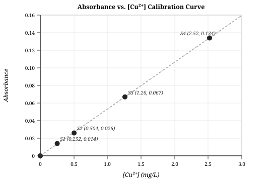

# Lab 10: Atomic Absorption Spectroscopy
## Chemistry 150 - Winter 2026

| | |
|---|---|
| **Students** | David Dreyer (C0561419), Dylan Fraser (C0558267) |
| **Lab Section** | 2026W CHEM-150-X01AB |
| **Date Performed** | March 30, 2026 |

## Data

**Table 1.** Raw measurements.

| Measurement | Value |
|:---|:---:|
| Mass of copper metal (g) | 0.126 |

**Table 2.** Absorbance (signal) readings from AAS instrument.

| Sample | Volume Pipetted (mL) | Absorbance |
|:---|:---:|:---:|
| Standard 1 | 1 | 0.014 |
| Standard 2 | 2 | 0.026 |
| Standard 3 | 5 | 0.067 |
| Standard 4 | 10 | 0.134 |
| Fountain (unknown) | N/A | 0.003 |

---

## Calculations

### Standard Concentrations

The stock solution was prepared by dissolving 0.126 g of copper in a 100 mL volumetric flask:

$$C_1 = \frac{0.126\ \text{g}}{0.100\ \text{L}} = 1.26\ \text{g/L} = 1260\ \text{mg/L}$$

First dilution: 10 mL of stock into a 100 mL volumetric flask:

$$C_2 = 1260 \times \frac{10}{100} = 126\ \text{mg/L}$$

Second dilution: 10 mL of the above into a 100 mL volumetric flask:

$$C_3 = 126 \times \frac{10}{100} = 12.6\ \text{mg/L}$$

Working standards were prepared by pipetting $V_n$ mL of the 12.6 mg/L solution into 50 mL volumetric flasks:

$$C_n = 12.6 \times \frac{V_n}{50}\ \text{mg/L}$$

**Table 3.** Calculated concentrations and measured absorbances for each standard.

| Standard | Volume (mL) | Concentration (mg/L) | Absorbance |
|:---|:---:|:---:|:---:|
| S1 | 1 | 0.252 | 0.014 |
| S2 | 2 | 0.504 | 0.026 |
| S3 | 5 | 1.26 | 0.067 |
| S4 | 10 | 2.52 | 0.134 |

### Calibration Curve

$$A = 0.0532\ [\text{Cu}^{2+}] \qquad (R^2 = 0.9999)$$

### Concentration of Fountain Water

Solving for $[\text{Cu}^{2+}]$ using the measured fountain absorbance of 0.003:

$$[\text{Cu}^{2+}] = \frac{A}{0.0532} = \frac{0.003}{0.0532} = 0.056 \approx 0.06\ \text{mg/L}$$

---

## Conclusion

The copper concentration in the drinking fountain water was determined to be approximately **0.06 mg/L**.
